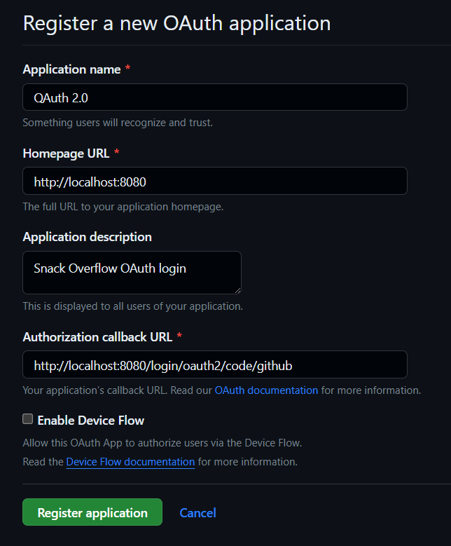
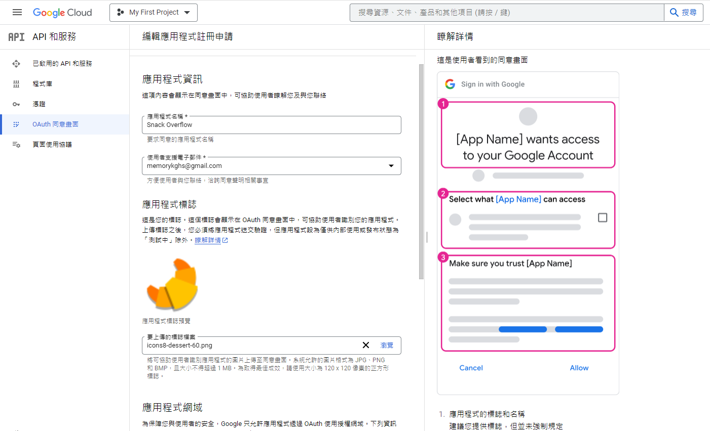
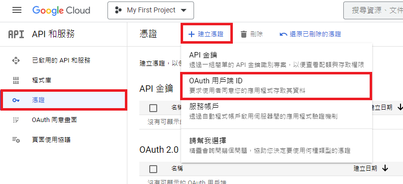
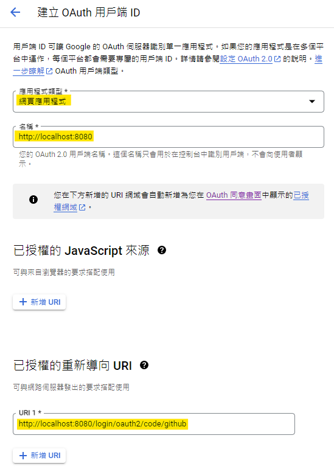
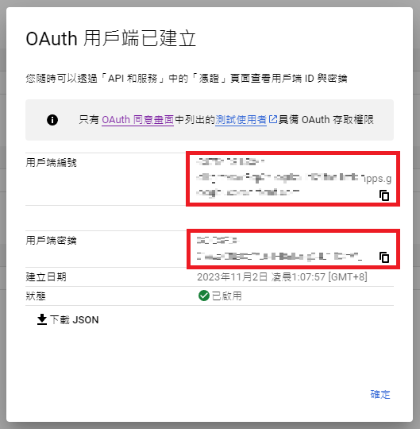
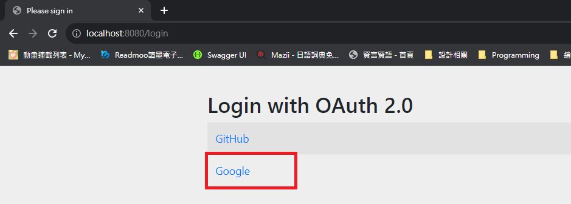
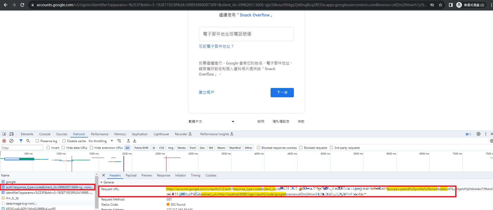

# Snack-Overflow

## Third Party Authentication Server 註冊

## GitHub

在[這裡](https://github.com/settings/developers)新增新的應用程式。

- Homepage URL：[http://localhost:8080](http://localhost:8080/)
- Authorization callback URL：http://localhost:8080/login/oauth2/code/github




>  💡 預設的 redirect URI template 是 `{baseUrl}/login/oauth2/code/{registrationId}`，其中 `registrationId` 是 ClientRegistration 的唯一識別碼。

> 💡 [ClientRegistration](http://www.rsqdz.net:907/ziyuan/spring-security/servlet/oauth2/client/core.html) 是向 OAuth 2.0 提供自定義註冊的客戶端的類別。


完成後替換掉 `application.yml` 內的設定。

### Google

參考：[https://xenby.com/b/245-教學-google-oauth-2-0-申請與使用指南](https://xenby.com/b/245-%E6%95%99%E5%AD%B8-google-oauth-2-0-%E7%94%B3%E8%AB%8B%E8%88%87%E4%BD%BF%E7%94%A8%E6%8C%87%E5%8D%97)

到 [Google API](https://console.developers.google.com/) 頁面新增。



建立憑證。



- Homepage URL：[http://localhost:8080](http://localhost:8080/)
- Authorization callback URL：http://localhost:8080/login/oauth2/code/google



將產生的用戶端編號及密鑰複製到 `application.yml`。



# Test

首先進到我們的首頁 [http://localhost:8080](http://localhost:8080/)，畫面上會出現登入選項，在下一個動作前先開啟 F12。

當按下 Sign in with Google 的時候，可以看到 Request URL 會帶一些資訊。



```javascript
https://accounts.google.com/o/oauth2/v2/auth?
  scope=profile&
  response_type=code&
  client_id=123456789&
  redirect_uri=http://localhost:8080/login/oauth2/code/google
```

